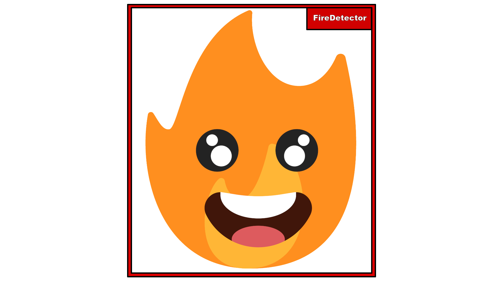
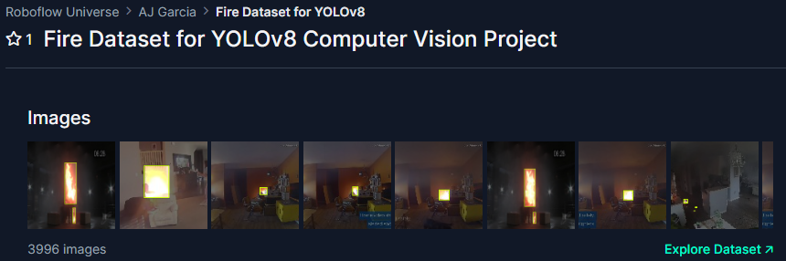
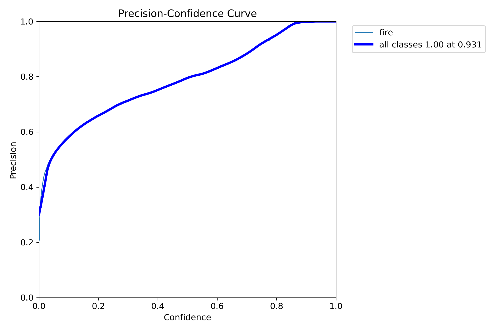
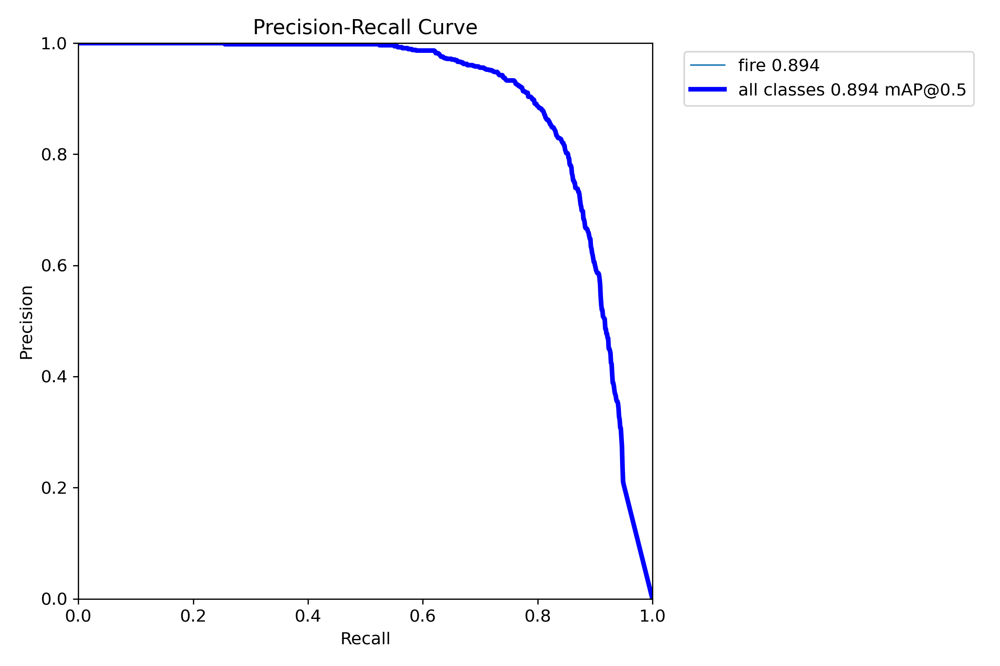
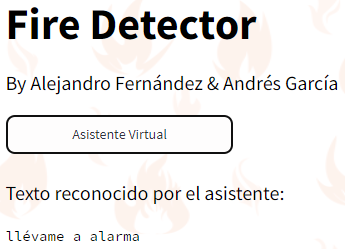

# Fire Detector


***Proyecto realizado por [Alejandro Fernández Romero](https://github.com/AlexFdezRomero) y [Andrés García Domínguez](https://github.com/agardom2002).***

**Web:** [🔥FireDetector🔥](https://firedetector-tfm.streamlit.app/).

**Vídeo:** [🎬Video_TFM.mov🎬](https://drive.google.com/file/d/1JZdZCCb6RiHNMdO3oGSmYF0dPP_pnUYL/view?usp=sharing)

## Índice
✔️[1. Justificación y descripción del proyecto.](#id1)

✔️[2. Obtención de datos.](#id2)

✔️[3. Limpieza de datos.](#id3) 

✔️[4. Exploración y visualización.](#id4)

✔️[5. Preparación de los datos para los algoritmos de Machine Learning.](#id5)

✔️[6. Entrenamiento del modelo y comprobación del rendimiento.](#id6)

✔️[7. NPL.](#id7)

✔️[8. Aplicación web.](#id8)

✔️[9. Conclusiones.](#id9)

✔️[10. Bibliografía.](#id10)

## 1. Justificación y descripción del proyecto.<a name="id1"></a>

🔥 ¡Atención a todos los amantes de la tecnología y la seguridad! 🔥 ¿Estás buscando una manera innovadora de proteger nuestros preciosos recursos naturales? ¡Entonces, este es el proyecto que estabas esperando!

🚒 Presentamos nuestro increíble Trabajo de Fin de Máster en Inteligencia Artificial y Big Data: ¡La solución definitiva para la detección de incendios en áreas naturales!

🌳 En un mundo donde los incendios forestales representan una seria amenaza para el medio ambiente y la seguridad pública, ¡nuestro proyecto brinda una solución inteligente y efectiva!

💡 Con la combinación de algoritmos de Inteligencia Artificial y análisis de Big Data, nuestro sistema puede detectar la presencia de fuego en áreas naturales de manera precisa y oportuna. ¡No más preocupaciones por incendios no detectados!

✅ ¿Por qué elegir nuestra solución?

- Eficiencia: Nuestro sistema utiliza algoritmos avanzados para analizar imágenes y datos en tiempo real, lo que permite una detección temprana y rápida de incendios.
- Precisión: Gracias a la inteligencia artificial, nuestro sistema reduce al mínimo los falsos positivos, garantizando una detección confiable.
- Escalabilidad: Diseñado para adaptarse a diferentes entornos y escalas, desde pequeñas áreas forestales hasta vastas extensiones de terreno.
- Facilidad de uso: Interfaz intuitiva y amigable que permite a los usuarios monitorear y gestionar el sistema con facilidad.
- Impacto ambiental: Al detectar incendios de manera temprana, ayudamos a prevenir la propagación y minimizamos el impacto ambiental y económico de los incendios forestales.

📈 ¡Únete a la revolución de la seguridad ambiental y haz la diferencia hoy mismo! ¡No esperes más para proteger nuestro planeta con nuestra innovadora solución de detección de incendios!

🔥 ¡No dejes que el fuego arruine nuestro futuro! 🔥

Este proyecto se basa en un modelo de reconocimiento y segmentación de imágenes en tiempo real entrenado para detectar si hay fuego en la imagen, utiliza un algoritmo llamado YOLO que se centra en este tipo de modelos
haciendo que sea mucho más veloz y preciso (Enlace a su [GitHub](https://github.com/ultralytics/ultralytics)).


***Imagen obtenida de la predicción del modelo entrenado.***

## 2. Obtención de datos.<a name="id2"></a>

Al utilizar el algoritmo YOLOv8, necesitamos tanto las imágenes para entrenar el modelo cómo la segmentación de estas imágenes para indicar cuál es el target, en este caso, el fuego.
Para ello, una de las opciones es utilizar un dataset obtenido desde la página [Roboflow](https://universe.roboflow.com/-jwzpw/continuous_fire).



La otra opción elegida es obtener imágenes mediante Web **Scraping**, en este caso a la página [123rf](https://es.123rf.com/).
El Scraping se ha realizado en el siguente documento de [Google Colab](https://colab.research.google.com/drive/1MlYd4HSEIYstt9NFaYdvWlkac5OANCQ2?usp=sharing).

Comenzamos importando las librerias necesarias.
```python
import requests
import json
```

 Hacemos un pedido a la página y guardamos el objeto que nos devuelve.
```python
import requests

URL = 'https://es.123rf.com/imagenes-de-archivo/incendios_forestales.html'

respuesta = requests.get(URL)

if respuesta.status_code == 200:
    print(respuesta.text)
else:
    print(f"Error al hacer la solicitud. Código de estado: {respuesta.status_code}")
```

Instalamos beautifulsoup4.
```python
!pip install beautifulsoup4
```

Creamos un objeto BeautifulSoup para analizar el HTML de la respuesta.
```python
from bs4 import BeautifulSoup

sopa_html = BeautifulSoup(respuesta.text, 'html.parser')

print('Tipo de objeto:', type(sopa_html))
```

Creamos el directorio para almacenar las imágenes.
```python
import os
from urllib.parse import urljoin

directorio_imagenes = 'imagenes'
os.makedirs(directorio_imagenes, exist_ok=True)
```
Buscamos en la sopa html la etiqueta  y mostramos cuántas imágenes hay.
```python
imagenes_fuego = sopa_html.find_all('img')

print('img de incendio:', type(imagenes_fuego))
print('Longitud:', len(imagenes_fuego))
```
```
img de incendio: <class 'bs4.element.ResultSet'>
Longitud: 547
```
Obtener la URL base de la página, si la respuesta tiene una URL, usarla, si no, establecer una URL predeterminada 'https://es.123rf.com/'.
```python
url_base = respuesta.url if respuesta.url else 'https://es.123rf.com/'
```
Descargamos las imágenes y las guardamos en un carpeta.
```python
from google.colab import files
# Descargar y guardar cada imagen
for i, img in enumerate(imagenes_fuego, start=1):
    # Obtener la URL de la imagen
    url_imagen = urljoin(url_base, img['src'])

    # Descargar la imagen
    respuesta_imagen = requests.get(url_imagen)

    # Guardar la imagen en el directorio
    nombre_archivo = os.path.join(directorio_imagenes, f'imagen_{i}.png')
    with open(nombre_archivo, 'wb') as archivo:
        archivo.write(respuesta_imagen.content)

    print(f'Imagen {i} descargada y guardada como {nombre_archivo}')

# Comprimir el directorio en un archivo ZIP
nombre_archivo_zip = 'imagenes_fuego.zip'
os.system(f'zip -r {nombre_archivo_zip} {directorio_imagenes}')

# Descargar el archivo ZIP
files.download(nombre_archivo_zip)
```
```
# Resultado del scraping:
Imagen 1 descargada y guardada como imágenes/imagen_1.png
Imagen 2 descargada y guardada como imágenes/imagen_2.png
Imagen 3 descargada y guardada como imágenes/imagen_3.png
...
Imagen 545 descargada y guardada como imágenes/imagen_545.png
Imagen 546 descargada y guardada como imagenes/imagen_546.png
Imagen 547 descargada y guardada como imagenes/imagen_547.png
Proceso completado. Carpeta comprimida y descargada como "imagenes_fuego.zip".
```
Solo queda repetir este proceso con las ditintas páginas hasta conseguir el número de imágenes deseadas.

## 3. Limpieza de datos. <a name="id3"></a>

Comprobamos cómo están estructurados los archivos. Enlace al [Colab](https://colab.research.google.com/drive/18FPsWTwqpxLTKTJ20FPWeRT8XqzYQ3Td?usp=sharing) correspondiente.

En este dataset estructurado en árboles de carpetas encontramos tres ramas importantes; train, test y valid. En cada una de estas carpetas hay una carpeta que guarda las imágenes y otra que contiene los archivos .txt para indicar la segmentación de la imagen.

Si nos fijamos en la carpeta train, nos damos cuenta las imágenes tienen la misma estructura: [nombre]_png.rf.[identificador].jpg. Además, este identificador lo contiene el mismos archivo .txt asociado a esta imagen en su respectiva carpeta.

Esta información la usaremos para comprobar que cada imagen tenga un label asociado, así como que cada carpeta contenga archivos de extensión correcta (.txt para los labels y .png o .jpg para las imágenes). Si no ocurre esto, se guardará este archivo o carpeta en una nueva carpeta creada para decidir qué hacer con ella.

Pasos a seguir:

Instalamos el paquete **RoboFlow** que es necesario para descargar el dataset.

```python
!pip install roboflow
```

Importamos las librerías necesarias para el tratamiento de los datos.

```python
import os
import shutil

from roboflow import Roboflow
```

Utilizando una API de RoboFlow descargamos el dataset necesario.

```python
rf = Roboflow(api_key="MAiCeSuy58yjlg2ma4QK")
project = rf.workspace("-jwzpw").project("continuous_fire")
dataset = project.version(6).download("yolov8")
```

Creamos el código necesario para verificar que cada imagen tiene al menos un archivo .txt que indicará que tiene una segmentación de imagen indicando que tiene el target (el fuego) aplicado.

```python
# Creamos un array con los nombres de las carpetas a recorrer
carpetas = ["test", "train", "valid"]

# Inicializamos dos contadores, uno para los archivos correctos y otros para 
cont = {"test": 0, "train": 0, "valid": 0,}

for nombre in carpetas:

    # Ruta de las carpetas
    carpeta_images = f"/content/continuous_fire-6/{nombre}/images"
    carpeta_labels = f"/content/continuous_fire-6/{nombre}/labels"

    # Obtenemos la lista de archivos en ambas carpetas
    archivos_images = os.listdir(carpeta_images)
    archivos_labels = os.listdir(carpeta_labels)

    # Inicializamos una lista para guardar los identificadores de los labels
    identificadores_labels = set()

    for archivo_label in archivos_labels:

        # Si el archivo termina en .txt obtenemos su identificador
        if archivo_label.endswith(".txt"):
            identificador = archivo_label.split(".")[-2]
            identificadores_labels.add(identificador)

        # De lo contrario, guardamos la ruta del archivo y lo almacenamos en otra carpeta
        else:
            # Con os.path.join() creamos la ruta del archivo
            ruta_label = os.path.join(carpeta_labels, archivo_label)

            # Inicializamos la ruta de destino
            ruta_destino = f"/content/continuous_fire-6/No_Compatibles/{nombre}/"

            print(f"""El archivo {archivo_label}, en la carpeta {nombre} no es un archivo .txt.\n
Será enviado a la carpeta {ruta_destino} \n""")

            # Mediante un try: , except: verificamos si existe la carpeta de destino y guardamos el archivo.
            try:
              os.mkdir(ruta_destino)
              shutil.move(ruta_label, ruta_destino)

            except:
              shutil.move(ruta_label, ruta_destino)

    # Comprobamos por cada imagen si tiene un label asociado
    for archivo_image in archivos_images:

        # Verificamos que el archivo sea .jpg o .png . Si es así guardamos su identificador
        if archivo_image.endswith(".jpg") or archivo_image.endswith(".png"):
            identificador = archivo_image.split(".")[-2]
        else:
            ruta_imagen = os.path.join(carpeta_images, archivo_image)
            ruta_destino = f"/content/continuous_fire-6/No_Compatibles/{nombre}/"

            print(f"""El archivo {archivo_image}, en la carpeta {nombre} no es un archivo .jpg o .png.\n
Será enviado a la carpeta {ruta_destino} \n""")

            try:
              os.mkdir(ruta_destino)
              shutil.move(ruta_imagen, ruta_destino)

            except:
              shutil.move(ruta_imagen, ruta_destino)

        # Verificar si existe un archivo con el mismo identificador en la carpeta "labels"
        if identificador in identificadores_labels:
            cont[nombre] += 1
        else:
            print(f"""La imagen con identificador {identificador} no tiene un archivo en la carpeta 'labels' en {nombre}.
Eliminando la imagen... \n""")
            ruta_imagen = os.path.join(carpeta_images, archivo_image)
            os.remove(ruta_imagen)

for nombre in carpetas:
  print(f"Número de imágenes en la carpeta {nombre:5} con label asociado: {cont[nombre]}")
```

## 4. Exploración y visualización.<a name="id4"></a>

Para descargar el dataset de imágenes para entrenar el modelo podemos usar los siguientes comandos:

- Instalamos los paquetes necesarios e importamos las librerías.
```python

!pip install ultralytics==8.0.196
!pip install roboflow

import ultralytics
from roboflow import Roboflow
from ultralytics import YOLO

```

- Descargamos los datos desde la página de **Roboflow**.

```python

import ultralytics
from roboflow import Roboflow
from ultralytics import YOLO

```

En este ejemplo lo copiamos a nuestro Google Drive con el siguiente comando.

```python

!cp -r /content/continuous_fire-6 /content/drive/MyDrive/Data-FireDetector

```

Teniendo la carpeta descargada en nuestro Google Drive podemos ver los diferentes árboles de carpetas que trae.


Por un lado, vemos dos README que indican las credenciales del dataset perteneciente a RoboFlow. Además, observamos un archivo **data.yaml**
que incluye la información sobre las rutas de entrenamiento, prueba y validación así como los distintos targets (en este caso sólo *fire*) y 
algunas credenciales de RoboFlow.

Por otro lado, encontramos tres carpetas, cada una con otras dos carpetas en su interior, una que guarda las imágenes y otra que contiene
en archivos **.txt** las coordenadas de la segmentación de la imagen que indica qué es el objetivo.

Primero vemos la carpeta con las imágenes de entrenamiento:


Ahora vemos la carpeta con las coordenadas de cada imagen:


Si abrimos uno de estos documentos observamos las coordenadas de uno de los segmentos:


## 5. Preparación de los datos para los algoritmos de Machine Learning.<a name="id5"></a>

Si queremos segmentar imágenes manualmente para añadirlas al dataset podemos instalar en nuestro equipo **labelme**. En este caso lo hemos instalado y utilizado con Visual Studio Code.
```python
pip install labelme
```

Una vez instalado, se puede iniciar escribiendo **labelme** en la terminal. 
Indicamos la carpeta donde se encuentran las imágenes a segmentar. El sigiente paso es mediante el ratón, indicar la zona del objetivo (target) y etiquetarlo. 
Con cada imagen, se genera un archivo .json que indica las coordenadas de la segmentación del target en la imagen.


Cuando se hayan segmentado y etiquetado todas las imágenes tenemos que instalar **labelme2yolo** para transformar los datos para el algoritmo.

```python
pip install labelme2yolo
```
Tras instalarlo debemos ejecutar el siguiente comando para preparar los datos:

```python
labelme2yolo --json_dir "Ruta de la carpeta con las imágenes"
```

Se puede observar que al ejecutar la transformación se genera una carpeta que prepara el dataset para el entrenamiento, separa por un lado las imágenes de los archivos .json asociados. Además,
crea un archivo **dataset.yaml** que será el que utilizaremos para realizar el entrenamiento.


 
## 6. Entrenamiento del modelo y comprobación del rendimiento.<a name="id6"></a>

Enlace al entrenamiento en un documento de [Google Colab](https://colab.research.google.com/drive/1mmFQI4K9Ic9whAI8TFCMuOtnLl3uUM4S?usp=sharing).

### **Entrenamiento del modelo YOLOv8**

Instalación de los paquetes necesarios:

* **ultralytics:** Para obtener y entrenar el modelo.
* **roboflow:** Para descargar el dataset de imágenes para el entrenamiento.

```python
!pip install ultralytics==8.0.196
!pip install roboflow
```

Importamos las librerías necesarias tanto para descargar el dataset como para entrenar el modelo.

```python
import ultralytics
from roboflow import Roboflow
from ultralytics import YOLO
```
Descargamos el dataset de imágenes. Para ello usamos la API proporcionada de Roboflow.

```python
rf = Roboflow(api_key="MAiCeSuy58yjlg2ma4QK")
project = rf.workspace("-jwzpw").project("continuous_fire")
dataset = project.version(6).download("yolov8")
```
Comando para realizar el entrenamiento del modelo.

Los diferentes parámetros que se usan son:

- **task**: Sirve para indicar la tarea a realizar.
  - detect: Consiste en detectar objetos en una imagen o video, dibujando cuadros a su alrededor calificándolos según sus características. Puede detectar varios objetos a la vez.
  - segment: Segmenta una imagen en diferentes regiones basándose en el contenido de la imagen. A cada region se la asigna una etiqueta. En diferencia con *detect*, no es un cuadro, es la silueta del objeto.
  - classify: Clasifica una imagen en diferentes categorías basándose en su contenido.
  - pose: Detecta los puntos clave de un objeto en un fotograma y se utilizan
  para seguir el movimiento o estimar la pose.

- **mode**:
  - train: Afinar el modelo en un conjunto de datos personalizados o precargados. El proceso consiste en optimizar los parámetros para una mayor
  precisión.
  - val: Se utiliza para un modelo una vez entrenado. Evalúa su precisión y
  rendimiento, permitiendo ajustar los hiperparámetros para mejorar su rendimiento.
  - predict: Se carga el modelo entrenado y se le proporcionan nuevas imágenes o videos para ver su funcionamiento.
  - export: Permite exportar el modelo a un formato que pueda utilizarse para su
  despliegue.
  - track: Modo seguimiento. Con el modelo entrenado, se le proporciona un flujo de vídeo en directo para seguir objetos en tiempo real.
  - benchmark: Su utiliza para perfilar la velocidad y precisión de varios formatos de exportación. Con información como; el tamaño del formato exportado, las diferentes métricas y el tiempo de inferencia por imagen, podemos elegir el formato más óptimo.

- **model**: Modelo a utilizar, en este caso *yolov8s.pt*.
Para yolov8 hay diferentes variantes; **n** (nano), **s** (small), **m** (medium), **l** (large) y **x** (extra large).

- **data**: Ruta donde se encuentra el archivo **.yaml** que indica los diferentes directorios de entrenamiento y validación.

- **epochs**: Establecer el número de iteraciones de los datos de entrenamiento.

- **imgsz**: Especificar el tamaño de las imágenes.

- **plots**: Indicar que se generen gráficas para evaluar el rendimiento del entrenamiento.
```python
!yolo task=detect mode=train model=yolov8s.pt data=/content/continuous_fire-6/data.yaml epochs=80 imgsz=640 plots=True
```

Forma para descargar la carpeta runs de forma local en nuestro equipo.

```python
from google.colab import files
files.download('/content/runs')
```

Montar nuestro Google Drive.

```python
from google.colab import drive
drive.mount('/content/drive')
```

Copiamos la carpeta runs a un directorio de nuestro Google Drive.

```python
!cp -r /content/runs /content/drive/MyDrive/runs
```

Tras terminar el entrenamiento vemos un resumen de las iteraciones que ha realizado. Nos fijamos que el modelo ha alcanzado una precisión del 88,31%.

| **epoch** | **train/box_loss** | **train/cls_loss** | **train/dfl_loss** | **metrics/precision(B)** | **metrics/recall(B)** | **metrics/mAP50(B)** | **metrics/mAP50-95(B)** | **val/box_loss** | **val/cls_loss** | **val/dfl_loss** | **lr/pg0** | **lr/pg1** | **lr/pg2** |
|-----------|--------------------|--------------------|--------------------|--------------------------|-----------------------|----------------------|-------------------------|------------------|------------------|------------------|------------|------------|------------|
| 1         | 1.5482             | 2.4676             | 1.52               | 0.2994                   | 0.45368               | 0.31052              | 0.15748                 | 1.6036           | 3.9442           | 1.6668           | 0.00065608 | 0.00065608 | 0.00065608 |
| 2         | 1.5498             | 1.7261             | 1.5374             | 0.15422                  | 0.24947               | 0.09754              | 0.03113                 | 2.5966           | 10.198           | 3.1666           | 0.0013064  | 0.0013064  | 0.0013064  |
| 3         | 1.6696             | 1.7763             | 1.6429             | 0.17021                  | 0.43368               | 0.1711               | 0.05997                 | 1.9944           | 12.878           | 2.7897           | 0.0019402  | 0.0019402  | 0.0019402  |
| 4         | 1.6521             | 1.678              | 1.6184             | 0.02385                  | 0.07895               | 0.00919              | 0.0037                  | 2.7676           | 16.016           | 2.7448           | 0.0019258  | 0.0019258  | 0.0019258  |
| 5         | 1.5977             | 1.5831             | 1.5863             | 0.59603                  | 0.60211               | 0.56022              | 0.30581                 | 1.5828           | 2.1703           | 1.6896           | 0.0019258  | 0.0019258  | 0.0019258  |
| ...        | ...             | ...            | ...              | ...                   | ...               | ...              | ...                  | ...           | ...          | ...            | ...  | ...  | ...  |
| 75        | 0.75444            | 0.47607            | 1.0348             | 0.86927                  | 0.78105               | 0.87979              | 0.64218                 | 0.97949          | 0.8365           | 1.2372           | 0.00019325 | 0.00019325 | 0.00019325 |
| 76        | 0.73771            | 0.46127            | 1.0283             | 0.86209                  | 0.79789               | 0.88628              | 0.64989                 | 0.97961          | 0.83844          | 1.2291           | 0.0001685  | 0.0001685  | 0.0001685  |
| 77        | 0.72293            | 0.44233            | 1.0044             | 0.87006                  | 0.79368               | 0.88495              | 0.64534                 | 0.97614          | 0.82528          | 1.2272           | 0.00014375 | 0.00014375 | 0.00014375 |
| 78        | 0.70837            | 0.43255            | 1.0045             | 0.87084                  | 0.80947               | 0.88686              | 0.65076                 | 0.97163          | 0.80264          | 1.221            | 0.000119   | 0.000119   | 0.000119   |
| 79        | 0.70564            | 0.4307             | 1.0002             | 0.8831                   | 0.80211               | 0.89361              | 0.65726                 | 0.96027          | 0.77231          | 1.208            | 9.425e-05  | 9.425e-05  | 9.425e-05  |
| 80        | 0.69584            | 0.42559            | 0.99257            | 0.87153                  | 0.81407               | 0.89305              | 0.65215                 | 0.97947          | 0.79239          | 1.2251           | 6.95e-05   | 6.95e-05   | 6.95e-05   |

Por otro lado, podemos ver una foto generada por el propio modelo dónde nos muestra diferentes gráficas con los resultados.


Podemos ver otras imágenes que nos crea para ver el rendimiento como la precisión según la confianza (confidence):



También visualizamos la gráfica de la precisión según el recall:



Observamos la matriz de confusión y nos aseguramos de que no detecta el fondo como fuego y viceversa.


Además, Yolo nos genera otras gráficas como la matriz de correlación sobre la **anchura** y **altura** de la zona detectada con las coordenadas **(x, y)** de esta segmentación.


Por último, podemos ver otras gráficas como la frecuencia con la que se repiten ciertas coordenadas de segmentación de imagen, así como su anchura y altura. 
También nos muestra gráficas directamente con la sección de detección en rojo, indicando con mayor intensidad donde más se repite.


### Comprobación en local con cámara

Para comprobar el funcionamiento del modelo, primero conectameros el modelo a una cámara de manera local.

Verificamos que tenemos ultralytics instalado.
```python
!pip install ultralytics
```
Instalamos la librería OpenCV para poder trabajar con la cámara.
```python
!pip install opencv-python==4.6.0.66
```

Importamos las librerias necesarias.
```python
import ultralytics
import cv2
from ultralytics import YOLO
from IPython.display import Image
```
Ejecutamos el código para poner en marcha la cámara con el modelo integrado:

```python
# Leer nuestro modelo, tenemos que especificar la ruta del modelo.
model = YOLO("best.pt")
# Capturar video
cap =  cv2.VideoCapture(1)

# Bucle
while True:
    # Leer fotogramas
    ret, frame = cap.read()

    # Leemos resultados
    resultados = model.predict(frame, imgsz = 640, conf=0.80)

    # Mostramos resultados
    anotaciones = resultados[0].plot()

    # Mostramos nuestros fotogramas
    cv2.imshow("DETECCION Y SEGMENTACION", anotaciones)

    # Cerrar nuestro programa
    if cv2.waitKey(1) == 27:
        break

cap.release()
cv2.destroyAllWindows()
```

**Resultados cámara local**


## 7. NPL.<a name="id7"></a>

Para este apartado hemos decidido añadir tres funcionalidades:

- **Reconocimiento de voz:** Botón en la página web que nos detecta el micrófono y que, al reconocer en el audio uno de los apartados de la página no llevará a este.

- **Alarma sonora:** En el apartado *Alarma*, si al tomar una foto se detecta fuego, sonará una voz (en diferentes idiomas según configuración) avisando del fuego.

- **Verificación de correo electrónico:** El usuario podrá introducir un correo electrónico para que, al detectar fuego al tomar una imagen.

### 7.1 Reconocimiento de voz

Creamos un botón en la página web que detecte el micrófono del usuario. Al pulsarlo nos reconocerá la voz hasta que lo volvamos a pulsar. 



Una vez reconoce la voz se realiza el procesamiento del lenguaje necesario para:

- Convertir el texto a minúsculas.
  
- Eliminar las tildes.
  
- Tokenizar el texto.
  
- Eliminar las stop words.

Instalamos los paquetes necesarios:

```python
!pip install nltk
!pip install unidecode
```

Importamos las librerías a utilizar:

```python
import nltk
import unidecode

from nltk.corpus import stopwords
from nltk.tokenize import word_tokenize

nltk.download('punkt')
nltk.download('stopwords')
```

Definicmos la función para procesar el texto.

```python
def procesar_texto(texto):
    # Convertir a minúsculas
    texto = texto.lower()
    
    # Eliminar tildes
    texto = unidecode.unidecode(texto)
    
    # Tokenización
    tokens = word_tokenize(texto)
    
    # Eliminar stopwords
    stop_words = set(stopwords.words('spanish'))
    tokens = [word for word in tokens if word not in stop_words]

    # Comprobamos si alguno de los tokens coincide con uno de los apartados
    for token in tokens:
        if token in pre_titles:
            # Si uno de los tokens coincide devolvemos esta palabra
            return token
    
    # Unir tokens en un solo string
    processed_text = ' '.join(tokens)

    # Si ningun token coincide devolvemos todo el texto procesado
    return processed_text
```

### 7.2 Alarma sonora

Cuando al tomar una foto se detecte fuego sonará una voz avisando de este.

Paquetes necesarios:

```python
gTTS
```

Librerías:

```python
import base64
from gtts import gTTS
```

Empezamos declarando la función para pasar texto a audio.

```python
# Pasar de texto a audio
# Parametros:
# - text: Texto para pasar a audio
# - lang: Idioma con el que convertir el texto 
# - slow: Indicar la velocidad de reproduccion del audio
def text_to_speech(text, lang='en', slow=False):
    tts = gTTS(text=text, lang=lang, slow=slow)
    return tts
```

También declaramos la función que reproducirá el audio automáticamente.

```python
# Función para reproducir el audio de manera automatica
def autoplay_audio(ruta_archivo: str):
    # Abrimos el archivo en modo lectura binaria
    with open(ruta_archivo, "rb") as archivo:
        # Leemos los datos y los guardamos en una variable
        data = archivo.read()
        # Codificamos los datos en base64 para insertarlo en HTML
        b64 = base64.b64encode(data).decode()
        # Codigo HTML para reproducir de forma automatica el audio
        md = f"""
            <audio controls autoplay="true" style="display:none">
            <source src="data:audio/mp3;base64,{b64}" type="audio/mp3">
            </audio>
            """
        
        # Mediante markdown lo introducimos en la página para que se ejecute
        st.markdown(
            md,
            unsafe_allow_html=True,
        )
```

Los distintos idiomas que hemos implementado son:

```python
LANGUAGES = {
    'English': 'en',
    'Spanish': 'es',
    'French': 'fr',
    'German': 'de',
    'Italian': 'it',
}
```

Las frases según el idioma seleccionado son:

```python
texto_audio = {"es": "ALERTA! FUEGO DETECTADO!",
               "en": "Alert, fire detected",
               "fr": "Alerte, incendie détecté",
               "de": "Alarm, Feuer erkannt",
               "it": "Allerta, rilevato incendio"}
```

### 7.3 Verificación de correo electrónico

Para verificar que el usuario ha introducido un correo electrónico válido usamos una expresión regular.

Importamos la librería **re**.

```python
import re
```

Creamos la función para comprobar el email.

```python
def validar_correo(email):
    # Expresión regular para validar correo electrónico
    regex = r'^(([^<>()\[\]\\.,;:\s@\"]+(\.[^<>()\[\]\\.,;:\s@\"]+)*)|(\".+\"))@((\[[0-9]{1,3}\.[0-9]{1,3}\.[0-9]{1,3}\.[0-9]{1,3}\])|(([a-zA-Z\-0-9]+\.)+[a-zA-Z]{2,}))$'
    
    # Validar el correo con la expresión regular
    if re.match(regex, email):
        return True
    else:
        return False
```

## 8. Aplicación web.<a name="id8"></a>

La web se ha realizado en Streamlit.

El enlace a la Web es el siguente: [🔥FireDetector🔥](https://firedetector-tfm.streamlit.app/).

**Vídeo - Presentación TFM:** ["Video_TFM.mov"](https://drive.google.com/file/d/1JZdZCCb6RiHNMdO3oGSmYF0dPP_pnUYL/view?usp=sharing)

A continuación tenemos el app.py usado para crear la web en Streamlit.
```python
import av
import os
import re
import cv2
import nltk
import base64
import tempfile
import unidecode
import numpy as np
import streamlit as st

from gtts import gTTS
from ultralytics import YOLO
from nltk.corpus import stopwords
from MandarCorreo import enviar_correo
from nltk.tokenize import word_tokenize
from streamlit_mic_recorder import mic_recorder, speech_to_text
from streamlit_webrtc import webrtc_streamer, WebRtcMode, RTCConfiguration

# -- CONFIGURACION DE LA PAGINA --

# Cambiamos el icono y nombre de la pestaña
st.set_page_config( 
    page_title="FireDetector", 
    page_icon="🔥",)

# Creamos una funcion para cargar el archivo CSS local (style.css)
def local_css(file_name):
    with open(file_name) as f:
        st.markdown('<style>{}</style>'.format(f.read()), unsafe_allow_html=True)

# Llamamos a la funcion (local_css) para cargar el archivo CSS
local_css("Web-Streamlit/src/style.css")

# Cambiamos los estilos de los botones
st.markdown(
    """
    <style>
    button.myButton {
        border-color: black;
        background-color: white;
        color: black;
        cursor: pointer;
    }
    </style>
    """,
    unsafe_allow_html=True
)

# -- INICIALIZACION DE VARIABLES --

# Cargamos el modelo de detección de fuego
model = YOLO("Web-Streamlit/model/best.pt")

# Diccionario para los idiomas
LANGUAGES = {
    'English': 'en',
    'Spanish': 'es',
    'French': 'fr',
    'German': 'de',
    'Italian': 'it',
}

# Diccionario para la alarma según idioma
texto_audio = {"es": "ALERTA! FUEGO DETECTADO!", "en": "Alert, fire detected", "fr": "Alerte, incendie détecté",
               "de": "Alarm, Feuer erkannt", "it": "Allerta, rilevato incendio"}

# Inicializacion del array que guardara los apartados procesados con NPL
pre_titles = []

# Array que contiene los nombres de los apartados de la pagina
tab_titles = ["Introducción", "Configuración", "Detección", "Alarma"]

# -- INICIALIZACION DE ESTADOS DE SESION -- 

# Guardamos en una variable el estado de la sesion
state = st.session_state

# Mediante un estado de sesion (descarga) 
# comprobamos si se han realizado las descargas de NLTK
if 'descarga' not in state:
    state.descarga = True
    nltk.download('punkt')
    nltk.download('stopwords')

# Inicializamos el estado de sesion para los idiomas
if 'langs' not in state:
    state.langs = "Spanish"

# Inicializamos el estado de sesion para el correo
if 'email' not in state:
    state.email = False

# -- INTRODUCCION --

# Funcion que muestra todo el contenido del apartado 'Introduccion'
def tab_introduccion():
    st.subheader("Introducción: ", divider = "red")    
    st.write("""
        🔥 ¡Atención a todos los amantes de la tecnología y la seguridad! 🔥 ¿Estás buscando una manera innovadora de proteger nuestros preciosos recursos naturales? ¡Entonces, este es el proyecto que estabas esperando!

        🚒 Presentamos nuestro increíble Trabajo de Fin de Máster en Inteligencia Artificial y Big Data: ¡La solución definitiva para la detección de incendios en áreas naturales!
            
        🌳 En un mundo donde los incendios forestales representan una seria amenaza para el medio ambiente y la seguridad pública, ¡nuestro proyecto brinda una solución inteligente y efectiva!
            
        💡 Con la combinación de algoritmos de Inteligencia Artificial y análisis de Big Data, nuestro sistema puede detectar la presencia de fuego en áreas naturales de manera precisa y oportuna. ¡No más preocupaciones por incendios no detectados!
            
        ✅ **¿Por qué elegir nuestra solución?**
            
        - **Eficiencia:** Nuestro sistema utiliza algoritmos avanzados para analizar imágenes y datos en tiempo real, lo que permite una detección temprana y rápida de incendios.
            
        - **Precisión:** Gracias a la inteligencia artificial, nuestro sistema reduce al mínimo los falsos positivos, garantizando una detección confiable.
            
        - **Escalabilidad:** Diseñado para adaptarse a diferentes entornos y escalas, desde pequeñas áreas forestales hasta vastas extensiones de terreno.
            
        - **Facilidad de uso:** Interfaz intuitiva y amigable que permite a los usuarios monitorear y gestionar el sistema con facilidad.
            
        - **Impacto ambiental:** Al detectar incendios de manera temprana, ayudamos a prevenir la propagación y minimizamos el impacto ambiental y económico de los incendios forestales. 
            
        📈 ¡Únete a la revolución de la seguridad ambiental y haz la diferencia hoy mismo! ¡No esperes más para proteger nuestro planeta con nuestra innovadora solución de detección de incendios!
            
        🔥 ¡No dejes que el fuego arruine nuestro futuro! 🔥

        #### Descripción del proyecto

        **Este proyecto se basa en un modelo de reconocimiento y segmentación de imágenes en tiempo real entrenado para detectar si hay fuego en la imagen, utiliza un algoritmo llamado YOLO que se centra en este tipo de modelos haciendo que sea mucho más veloz y preciso.**
    """)

# -- CONFIGURACION --
# Funcion para validar correo
def validar_correo(email):
    # Expresión regular para validar correo electrónico
    regex = r'^(([^<>()\[\]\\.,;:\s@\"]+(\.[^<>()\[\]\\.,;:\s@\"]+)*)|(\".+\"))@((\[[0-9]{1,3}\.[0-9]{1,3}\.[0-9]{1,3}\.[0-9]{1,3}\])|(([a-zA-Z\-0-9]+\.)+[a-zA-Z]{2,}))$'
    
    # Validar el correo con la expresión regular
    if re.match(regex, email):
        return True
    else:
        return False
# Funcion para mostrar la informacion del apartado 'Configuracion'
def tab_configuracion():

    st.subheader("Configuración: ", divider = "red")    
    
    # Solicitamos al usuario su correo electrónico
    email_usuario = st.text_input("Ingrese su correo electrónico para recibir la alerta de fuego: ")

    # Comprobamos que ha introducido un correo 
    if email_usuario:
        
        if validar_correo(email_usuario):
            
            # Eliminamos el valor del estado de sesion
            del state.email
            # Le aplicamos a este estado el valor del email introducido
            state.email = email_usuario
        else:
            st.warning("Debe introducir un correo electrónico válido", icon="⚠️")

    # Mostramos un selector de idioma al usuario
    lang = st.selectbox("Selecione un idioma:", options=list(LANGUAGES.keys()))

    # Comprobamos que ha seleccionado un idioma
    if lang:
        # Eliminamos el valor del estado de sesion
        del state.langs
        # Le aplicamos a este estado el valor del idioma elegido
        state.langs = lang

# -- DETECCION --

# Inicializamos la clase 'ProcesadorVideo'
class ProcesadorVideo:

    # Constructor de la clase
    def __init__(self):
        pass

    # Metodo para recibir y procesar cada frame del video
    def recv(self, frame):

        # Transformamos el frame de Streamlit a una imagen de numpy BGR
        img = frame.to_ndarray(format="bgr24")
        # Usamos el modelo YOLO para predecir el fuego en el frame
        resultados = model.predict(img, imgsz=640, conf=0.37)
        # Añadimos la segmentacion con la deteccion a la imagen
        anotaciones = resultados[0].plot()

        # Convertimos el array de numpy a frame de Streamlit con el mismo formato
        return av.VideoFrame.from_ndarray(anotaciones, format="bgr24")

# Funcion para mostrar la informacion del apartado 'Deteccion'
def tab_deteccion():

    st.subheader("Detección de Vídeo: ", divider = "red")    

    # Configuracion de WebRTC (Web Real-Time Communication)
    # Establecemos el servidor ICE (Interactive Connectivity Establishment)
    rtc_configuration = RTCConfiguration(
        {"iceServers": [{"urls": ["stun:stun.l.google.com:19302"]}]}
    )

    # Configuracion y creacion del flujo de video mediante WebRTC
    # - key: Clave unica para identificar el flujo de vídeo
    # - mode: Modo de WebRTC, en este caso, SENDRECV, que permite enviar y recibir datos
    # - rtc_configuration: Configuracion del servidor ICE para la conexion WebRTC
    # - media_stream_constraints: Restricciones para la transmisión de medios, en este caso solo se permite video
    # - video_processor_factory: Clase que procesara cada frame de vídeo, en este caso, ProcesadorVideo
    # - async_processing: Habilita el procesamiento asincrono para evitar bloquear la interfaz de usuario
    webrtc_ctx = webrtc_streamer(
        key="fire-detection",
        mode=WebRtcMode.SENDRECV,
        rtc_configuration=rtc_configuration,
        media_stream_constraints={"video": True, "audio": False},
        video_processor_factory=ProcesadorVideo,
        async_processing=True,
    )

# -- ALARMA --

# TTS (Text To Speech):

# Pasar de texto a audio
# Parametros:
# - text: Texto para pasar a audio
# - lang: Idioma con el que convertir el texto 
# - slow: Indicar la velocidad de reproduccion del audio
def text_to_speech(text, lang='en', slow=False):
    tts = gTTS(text=text, lang=lang, slow=slow)
    return tts

# Función para reproducir el audio de manera automatica
def autoplay_audio(ruta_archivo: str):
    # Abrimos el archivo en modo lectura binaria
    with open(ruta_archivo, "rb") as archivo:
        # Leemos los datos y los guardamos en una variable
        data = archivo.read()
        # Codificamos los datos en base64 para insertarlo en HTML
        b64 = base64.b64encode(data).decode()
        # Codigo HTML para reproducir de forma automatica el audio
        md = f"""
            <audio controls autoplay="true" style="display:none">
            <source src="data:audio/mp3;base64,{b64}" type="audio/mp3">
            </audio>
            """
        
        # Mediante markdown lo introducimos en la página para que se ejecute
        st.markdown(
            md,
            unsafe_allow_html=True,
        )

# Funcion para mostrar la informacion del apartado 'Alarma'
def tab_alarma():

    st.subheader("Alarma: ", divider = "red")  

    # Guardamos en una variable el estado actual del idioma
    lang = state.langs

    # Checkbox para indicar si enviar un email o no
    env_mail = st.checkbox('Enviar correo electrónico')

    # Comprobamos que si se ha seleccionado
    if env_mail:

        # Verificamos que el email tiene valores mediante su estado de sesion
        if not state.email:
             # Si se selecciona 'env_mail' sin tener un email mostramos un warning
             st.warning("Debe introducir un correo electrónico en la casilla de configuración", icon="⚠️")

    # Funcion para ejecutar el audio de alarma y envio de correo si se detecta fuego
    def audio_fuego():
        tts = text_to_speech(texto_audio[LANGUAGES[lang]], LANGUAGES[lang])
        with tempfile.NamedTemporaryFile(delete=False, suffix=".mp3") as ruta_archivo:
            tts.save(ruta_archivo.name)
            autoplay_audio(ruta_archivo.name)
                        
        if env_mail:
    
            if state.email:
                try: 
                    enviar_correo(state.email)
                except:
                    st.error("Error al enviar correo electrónico", icon="🚨")
            else: 
                st.error("Debe introducir un correo electrónico", icon="🚨")

    # Funcion de streamlit que permite tomar capturas con la camara                 
    img_file_buffer = st.camera_input("")
    
    if img_file_buffer:
        # Leer img_file_buffer con CV2:
        bytes_data = img_file_buffer.getvalue()
        cv2_img = cv2.imdecode(np.frombuffer(bytes_data, np.uint8), cv2.IMREAD_COLOR)
        resultado = model.predict(cv2_img, imgsz=640, conf=0.37)
        anotaciones = resultado[0].plot()
        anotaciones = cv2.cvtColor(anotaciones, cv2.COLOR_BGR2RGB)

        # Si detecta fuego llama a la funcion de audio 
        if len(resultado[0]) > 0:
            audio_fuego()
    
        st.image(anotaciones)

# Tratado del texto
def procesar_texto(texto):
    # Convertir a minúsculas
    texto = texto.lower()
    
    # Eliminar tildes
    texto = unidecode.unidecode(texto)
    
    # Tokenización
    tokens = word_tokenize(texto)
    
    # Eliminar stopwords
    stop_words = set(stopwords.words('spanish'))
    tokens = [word for word in tokens if word not in stop_words]

    # Comprobamos para cada token si coincide con uno de los apartados
    for token in tokens:
        if token in pre_titles:
            # Si coincide devolvemos el token
            return token
    
    # Unir tokens en un solo string
    processed_text = ' '.join(tokens)

    # Si ningun token coincide devolvemos el texto procesado
    return processed_text

for title in tab_titles:
    pre_titles.append(procesar_texto(title))

# Contenido visible de la página
def main():
    
    # Logo
    st.image("Imgs/LogoFireDetectorDerecha.png", width=350)

    # Cabecera
    st.title("Fire Detector")
    st.write("By Alejandro Fernández & Andrés García")

    # Speech to text
    # Comprobamos si no tiene valor le asiganamos "Introduccion"    
    if 'mostrar' not in state:
        state.mostrar = "introduccion"

    # Creamos y centramos el boton de reconocimiento de voz
    col1, dol2, col3, col4 = st.columns(4)
    with col1:
        texto_audio = speech_to_text(language='es', start_prompt="Asistente Virtual", stop_prompt="Parar", use_container_width=True, just_once=True, key='STT')

    # Procesamos el texto captado
    if texto_audio:
        text = procesar_texto(texto_audio)

        # Compara los nombres de las paginas con el texto captado
        for title in pre_titles:
            if title in text:
                del state.mostrar
                state.mostrar = title

        st.write("Texto reconocido por el asistente:")
        st.text(texto_audio)
                   
    st.subheader("Menú: ", divider = "red")
   
    # Agregar los botones del menu en una fila horizontal
    col1, col2, col3, col4 = st.columns(4)
        
    with col1:
        introduccion = st.button(tab_titles[0], use_container_width=True)
    with col2:
        configuracion = st.button(tab_titles[1], use_container_width=True)
    with col3:
        deteccion = st.button(tab_titles[2], use_container_width=True)
    with col4:
        alarma = st.button(tab_titles[3], use_container_width=True)

    # Si el boton es pulsado nos redirige a la ruta correspondiente
    if introduccion:
        del state.mostrar
        state.mostrar = pre_titles[0]
    elif configuracion:
        del state.mostrar
        state.mostrar = pre_titles[1]
    elif deteccion:
        del state.mostrar
        state.mostrar = pre_titles[2]
    elif alarma:
        del state.mostrar
        state.mostrar = pre_titles[3]

    # Segun el estado de la variable ejecutamos una funcion u otra
    if state.mostrar == pre_titles[0]:
        tab_introduccion()
    elif state.mostrar == pre_titles[1]:
        tab_configuracion()
    elif state.mostrar == pre_titles[2]:
        tab_deteccion()
    elif state.mostrar == pre_titles[3]:
        tab_alarma()
        
            
if __name__ == "__main__":
    main()
```

## 9. Conclusiones.<a name="id9"></a>

La experiencia se adquiere trabajando con tecnologías desconocidas, es inmensa, no solo por el tiempo que se emplea buscando información, sino por la cantidad de errores y problemas que hay que resolver. Para nosotros, herramientas como YOLO o Streamlit han sido tanto una maravilla como un reto, pero estamos orgullosos del resultado obtenido, dado que ha cumplido con creces nuestras expectativas.

Hemos logrado un buen entrenamiento que le da robustez a nuestro modelo, así como una página con complementos y bien decorada dentro de lo que permite Streamlit. El hecho de trabajar con reconocimiento de imágenes nos ha permitido cubrir posibles vacíos de conocimiento y nos ha preparado para las prácticas y lo que venga más adelante.

Para terminar, nos gustaría agradecer al profesorado y al excelente contenido que nos ha ofrecido, del cual pueden surgir proyectos y relaciones personales como esta.

Atentamente - Andrés García y Alejandro Fernández

## 10. Bibliografía.<a name="id10"></a>

Recopilación de todos los recursos utilizados, algunos se encuentran a lo largo del **README**.

**Diapositivas - Presentación TFM:** https://docs.google.com/presentation/d/1vxPfJCT9PiGooqf7ZuYJarHhuGcqYK9dp3IKWR0yFNU/edit#slide=id.p

**Vídeo - Presentación TFM:** https://drive.google.com/file/d/1JZdZCCb6RiHNMdO3oGSmYF0dPP_pnUYL/view?usp=sharing

**Web Streamlit - FireDetector:** https://firedetector-tfm.streamlit.app

**GitHub - Ultralytics: https:** https://github.com/ultralytics/ultralytics

**Web de imágenes - 123rf:** https://es.123rf.com/

**Web Imágenes - RoboFlow:** https://universe.roboflow.com/-jwzpw/continuous_fire

**Google Colab - Scraping Web:** https://colab.research.google.com/drive/1MlYd4HSEIYstt9NFaYdvWlkac5OANCQ2?usp=sharing

**Google Colab - Limpieza de datos:** https://colab.research.google.com/drive/18FPsWTwqpxLTKTJ20FPWeRT8XqzYQ3Td?usp=sharing

**Google Colab - Entrenamiennto:** https://colab.research.google.com/drive/1mmFQI4K9Ic9whAI8TFCMuOtnLl3uUM4S?usp=sharing

**Tutorial - Mandar correo desde Python:** https://www.youtube.com/watch?v=oPAo8Hh8bj0

**Tutorial - Entrenar modelo YOLO:** https://www.youtube.com/watch?v=rk7zOBRJWCc

**Tutorial - Webcam Streamlit:** https://medium.com/mlearning-ai/live-webcam-with-streamlit-f32bf68945a4


